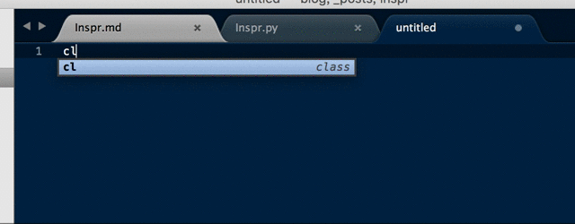

# Inspr
Inspr 是一个程序员命名解决方案，以插件的形式集成在主流编辑器中，专治各种命名头疼患者。

## 食用方式

输入中文，按下 Inspr 翻译快捷键，列出可选的命名方案。

例如 `let 军团（Ctrl + Command + i）`，弹出上下文联想菜单

```
corp, Corp, faction, Faction ....
```

## 插件效果



## 开发顺序

Sublime Text -> Atom -> VSCode -> JetBrain -> Eclipse -> Mac App

# 偏好设置

### 词典源（Dictionary Source）
Inspr 默认提供两个词典源，有道词典翻译和百度词典翻译，在偏好设置 `dictionary_source` 里指定可选的词典源，默认值是 `["Youdao", "Baidu"]`。

```
"dictionary_source": ["Youdao", "Baidu"]
```

### 清除选中（Clear Selection）
该设置表示用翻译结果替换选中区域的文字时，同时清除选中区域，默认值是 `true`。

### 自动检测单词（Auto Detect Words）
如果开启，则在 Sublime 的任何编辑区域按下快捷键时，会自动向左向右寻找单词文本，默认值是 `false`。

### 忽略单词（Ignore Words）
该设置里填写的单词将会在翻译中去除。默认值是 `["A", "a", "the", "The"]`。

### 完整提示（Full Inspiration)
如果启用，则在翻译结果中加入网络翻译和联想翻译，翻译精准度会降低，但将会提供更多可选项，默认值是 `true`。

### 结果显示为等宽字体（Show with Monospace Font）
如果启用，则结果列表的字体将显示为系统默认的等宽字体（monospace），默认值是 `true`。

### HTTP 代理（HTTP Proxy）
如果启用，则将通过代理服务器连接翻译 API 服务器，暂只支持 HTTP 代理，不支持 SOCKS 代理，默认值是空。

# License

```
Copyright 2016 zhix

Licensed under the Apache License, Version 2.0 (the "License");
you may not use this file except in compliance with the License.
You may obtain a copy of the License at

    http://www.apache.org/licenses/LICENSE-2.0

Unless required by applicable law or agreed to in writing, software
distributed under the License is distributed on an "AS IS" BASIS,
WITHOUT WARRANTIES OR CONDITIONS OF ANY KIND, either express or implied.
See the License for the specific language governing permissions and
limitations under the License.
```
